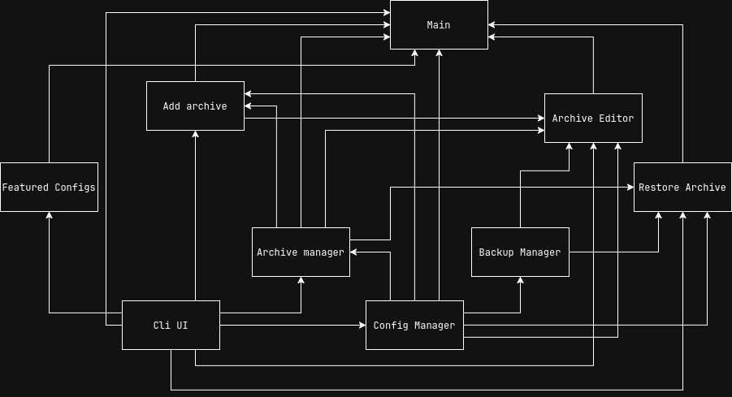

Este documento busca ser una guia ayuda para el desarrollador que desee modificar el codigo entendiendo el funcionamiento del programa

## Arquitectura

El proyecto se divide en las carpetas:

### Backend
Contiene todos los scripts del programa
- **main.py:**
    Este es el script principal para ejecutar la aplicacion
- **add_archive.py:**
    Se encarga de añadir nuevos archivos de configuracion a las configuraciones del programa.
- **archive_editor.py:**
    Se encarga de gestionar el sistema de edicion de los archivos de configuracion
- **archive_manager.py:**
    - Se encarga de gestionar los archivos de configuraciones
    - Verifica que existan en el sistema
    - Revisa si se encuentra el archivo en las configuraciones de la app
    - Obtiene el path del archivo si se encuentra en las configuraciones de la app
- **backup_manager.py:**
    Se encarga de generar las copias de seguridad de los archivos
- **cli_ui.py:**
    Se encarga de manejar la interfaz con el usuario
- **config_manager.py:**
    Se encarga de gestionar las configuraciones de la app
- **restore_archive.py**
    Se encarga de hacer las restauraciones de los archivos de configuracion del usuario

### Templates
Contiene las plantillas que usaran los scripts para generar sus configuraciones:
- **config.json:**
    Contiene las configuraciones del programa. Su estructura se divide en:
    - version: Version del programa
    - editor: Editor de preferencia del usuario
    - backup_configs: Configuraciones de los backups
    - path_configs: Contiene datos en una estructura (clave-valor) de los archivos de configuracion que el usuario quiere administrar "El nombre del archivo de configuracion"-"El path del archivo a guardar"

## Funcionalidades A Agregar
- Sistema de intercambio de archivos
- Sistema de comparacion de archivos